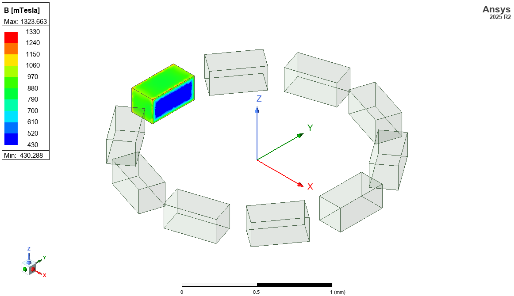
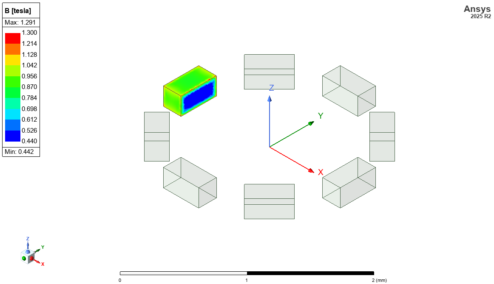

# MagnetArray
This repo is a collection of models for different magnet arrays using Ansys Electronics Desktop native IronPython.

Simulation results when the number of magnets is set to 10 are shown below 

Similarly, the results when the number of magnets is set to 8 are shown below 
