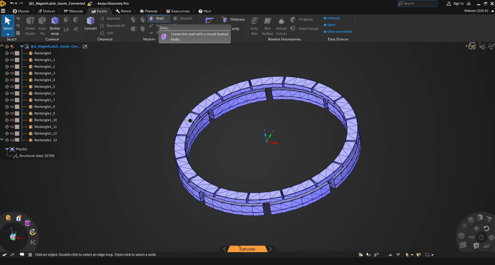
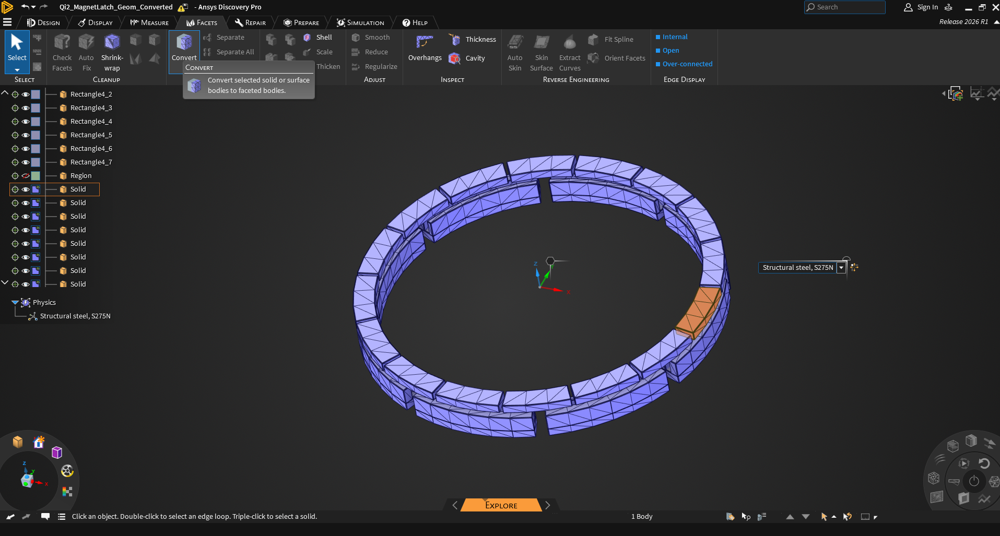

# MagnetArray
This repo is a collection of Maxwell models for different magnet arrays using Ansys Electronics Desktop native IronPython.

## Example 1: Radial Array with Rectangular Magnets

Simulation results when the number of magnets is set to 10 are shown below 

Similarly, the results when the number of magnets is set to 8 are shown below 

## Example 2: Radial Array with Arc Magnets

There are four groups of magnets. Magnet1_Group consists of 16 thin arc magnets (arc = 21deg) placed in a radial pattern. Each magnet is parallel magnetized. Magnet2_Group has 8 arc magnets (arc = 360deg/8*0.9 = 40.5deg) and they are parallel magnetized too. Magnet3_Group and Magnet4_Group correspond to the inner ring and outer ring, respectively. They are magnetized along the z-direction.

Magnet1_Group is built in a relative coordinate system RelativeCS_MovingParts. Its position and orientation are controlled by 6 geometric parameters (DispX, DispY, DispZ, angle_phi, angle_theta, angle_psi).

In order to achieve monotonic and fast convergence for energy and magnetic forces when the adaptive mesh refinement is used in Maxwell, it is recommended to add a dummy airbox for each piece of the magnet and assign the Force parameter to the magnet + airbox together. This can be easily done in CAD creation tools like Ansys Discovery by using the Shell feature.

In Ansys Discovery, we can go to FACETS -> Shell to create a thin wall outside each magnet. 

Then we can select the created facets and convert them into Solids. 
