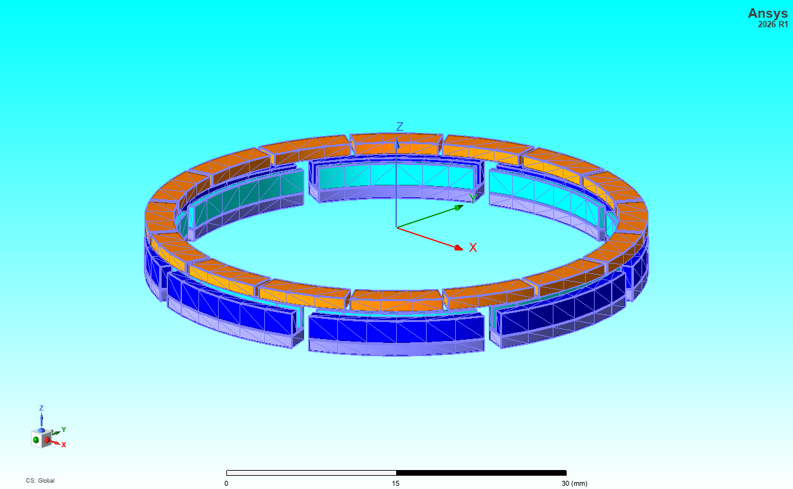
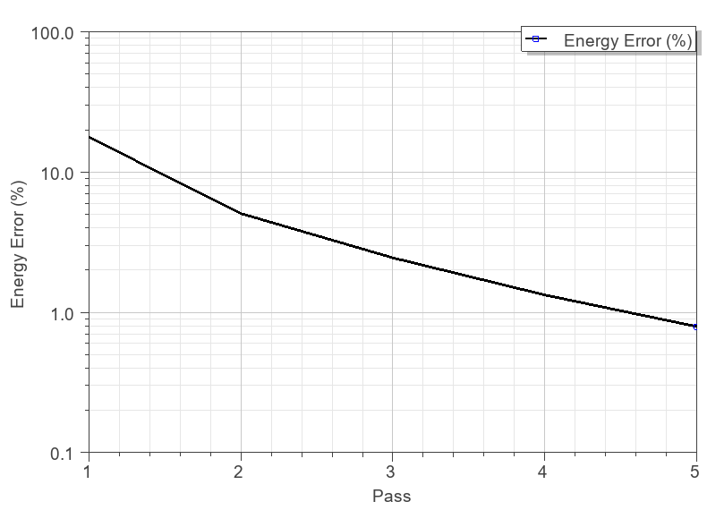
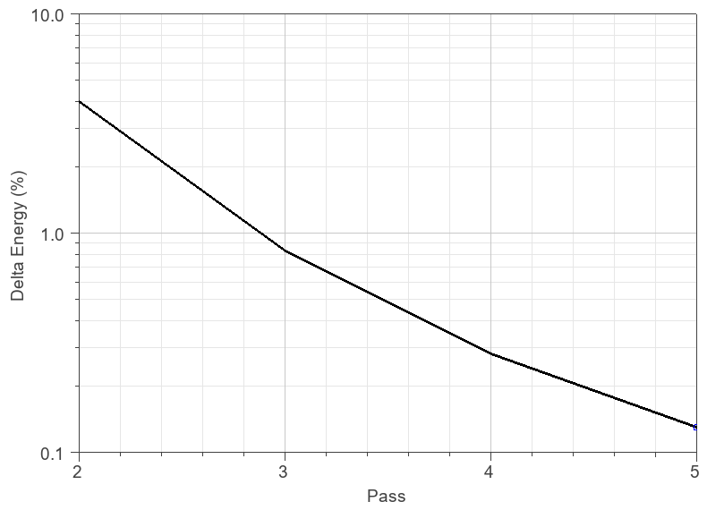
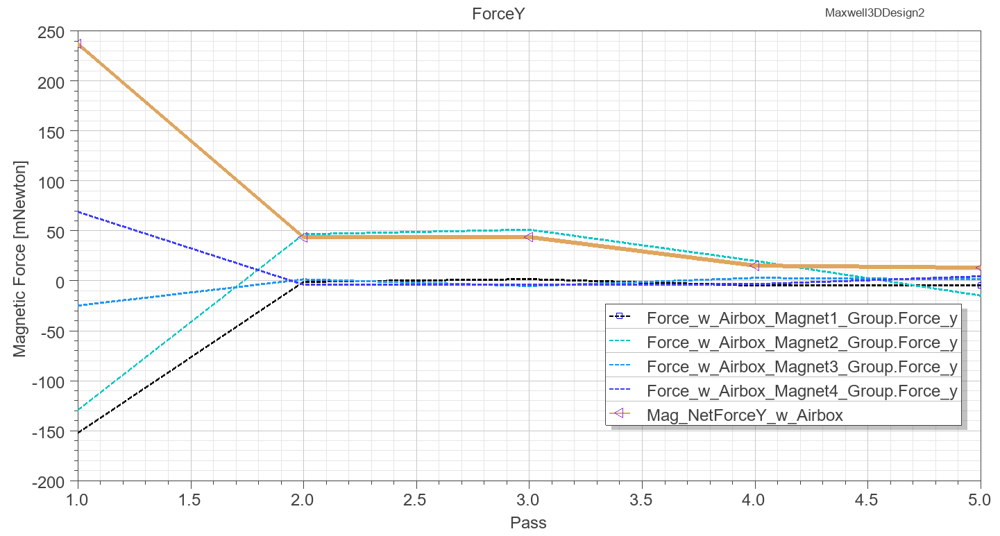
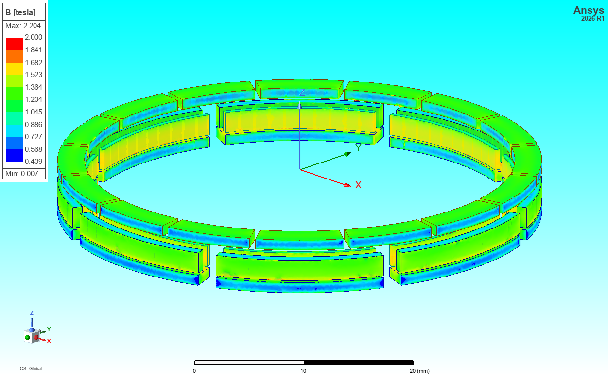
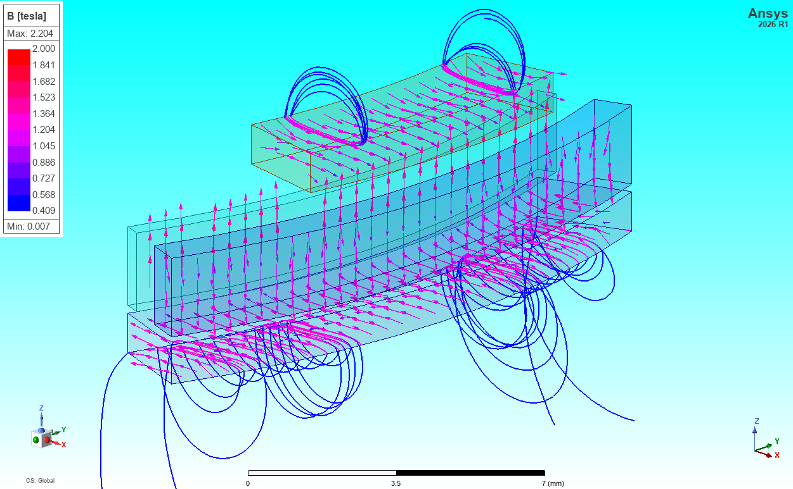
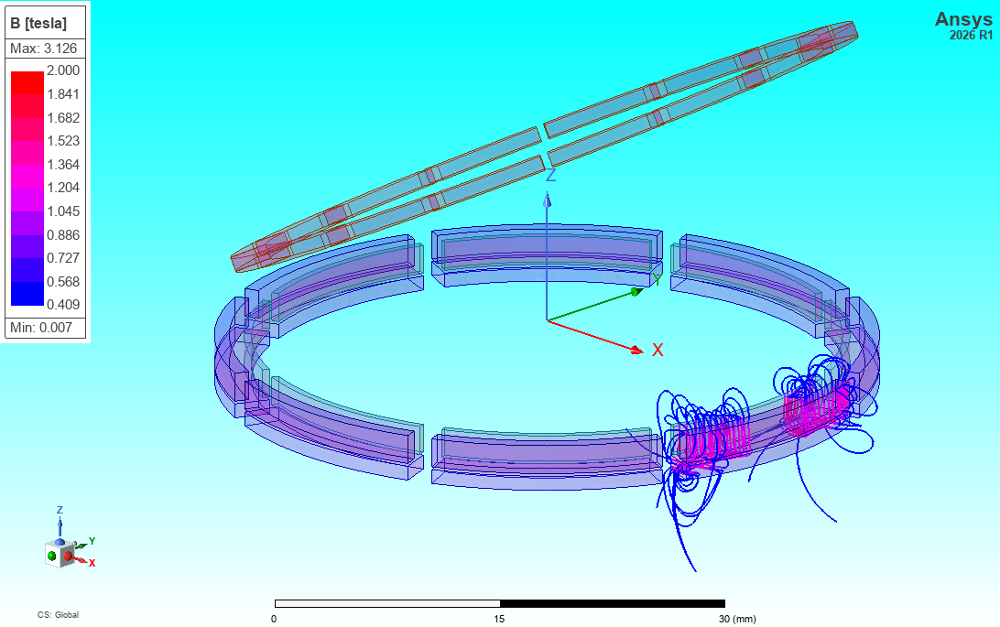

# MagnetArray

This repo is a collection of Maxwell models for different magnet arrays using Ansys Electronics Desktop native IronPython.

## Example 1: Radial Array with Rectangular Magnets

Simulation results when the number of magnets is set to 10 are shown below 

Similarly, the results when the number of magnets is set to 8 are shown below 

## Example 2: Radial Array with Arc Magnets

There are four groups of magnets. **Magnet1_Group** consists of 16 thin arc magnets (arc = 21deg) placed in a radial pattern. Each magnet is parallel magnetized. **Magnet2_Group** has 8 arc magnets (arc = 360deg/8*0.9 = 40.5deg) and they are parallel magnetized too. **Magnet3_Group** and **Magnet4_Group** correspond to the inner ring and outer ring, respectively. They are magnetized along the z-direction.

*Magnet1_Group* is built in a relative coordinate system **RelativeCS_MovingParts**. Its position and orientation are controlled by 6 geometric parameters **(DispX, DispY, DispZ, angle_phi, angle_theta, angle_psi)**.

In order to achieve monotonic and fast convergence for energy and magnetic forces when the adaptive mesh refinement is used in Maxwell, it is recommended to add a dummy airbox for each piece of the magnet and assign the Force parameter to the magnet + airbox together. This can be easily done in CAD creation tools like **Ansys Discovery** by using the **Shell** feature.

In **Ansys Discovery**, we can go to **FACETS -> Shell** to create a thin wall outside each magnet. 

Then we can select the created facets and convert them into Solids before importing the full geometry into Maxwell. 

The full geometry imported into Maxwell is shown below. The dummy airboxes are shown as tessellated parts tightly enclosing magnets.

There are 40 magnets in total in this model, so it becomes very necessary to run a script to set up the model. Two example scripts are provided here to show how to set up the magnetization for each magnet and how to assign force parameters for each magnet, each magnet group, and magnets + airboxes.

### Script 1: MagnetLatch_ProjectSetup_Modified.py (for Design 1)
### Script 2: MagnetLatch_ProjectSetup_ModifiedwithAirbox.py (for Design 2 and Design 3)

In order to test these two scripts, please delete all the relative CS related to magnet magnetization assignments and force parameter assignments and run the scripts thru **Tools -> Run Script...** inside of AEDT.

With the dummy airboxes, both the energy error and delta energy error reduce consistently within 5 passes.

  
  
  

Also it is clear that magnetic forces in x-, y-, and z-directions are converging with more passes. At the end of the simulation, magnetic forces in all the three directions are balanced.

The B magnitude plot and B streamlines are shown below.

The B streamline when the **Magnet1_Group** and **Magnet2_Group + Magnet3_Group + Magnet4_Group** are not well aligned is shown below.

If you'd like to learn more about the numerical methods for electromagnetic force calculation, here are some recommended reads:
1. F. Henrotte, K. Hameyer, Computation of Electromagnetic Force Densities: Maxwell Stress Tensor vs. Virtual Work Principle, vol. 168, no. 1-2, pp. 235-243, July 2004: <https://doi.org/10.1016/j.cam.2003.06.012>.
2. F. Henrotte, G. Deliege, K. Hameyer, The Eggshell Approach for the Computation of Electromagnetic Forces in 2D and 3D, vol. 23, no. 4, pp. 996-1005, COMPEL, Jan. 2004:<https://doi.org/10.1108/03321640410553427>.
3. F. Henrotte, C. Geuzaine, Electromagnetic Forces and Their Finite Element Computation, vol. 37, no. 5, Sept. 2024: <https://doi.org/10.1002/jnm.3290>.

